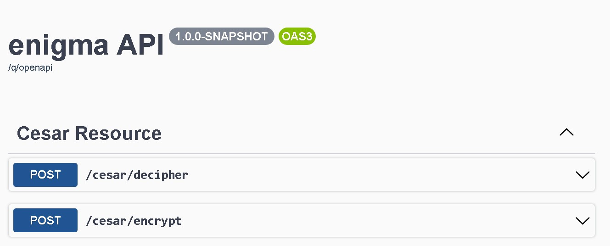
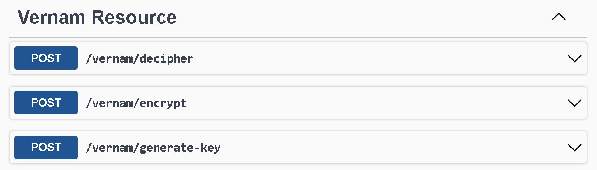
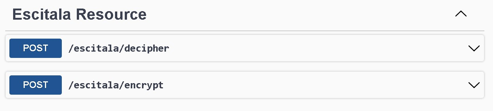
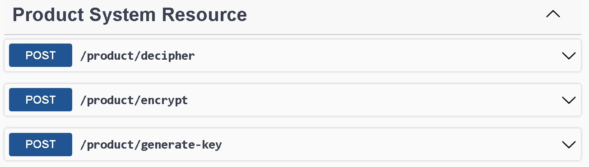

# Enigma
Proyecto de seguridad basado en la operación conjunta del algoritmo de cifrado César, Vigenere y Escitala; para crear un product system.

#!/bin/sh - comando para ejecutar la aplicación en modo developer
```
./mvnw compile quarkus:dev
```

## Carpeta Util
Esta es la logica que he usado para construir el algoritmo de Cesar, sabran que para descifrar el contenido del texto es solo ingresar el numero de rotations en negativo.
```
public String rotate(String originalChain, int rotations) {
    originalChain.toUpperCase();
    final int ALPHABET_LENGTH = 26, INIT_MINUSCULES = 97, INIT_CAPITAL = 65;
    String rotatedChain = "";
    for (int x = 0; x < originalChain.length(); x++) {
      char currentCharacter = originalChain.charAt(x);
      if (!Character.isLetter(currentCharacter)) {
        rotatedChain += currentCharacter;
        continue;
      }

      int currentAsciiCode = (int) currentCharacter;
      boolean isCapitalized = Character.isUpperCase(currentCharacter);

      int newAlphabetPosition = ((currentAsciiCode - (isCapitalized ? INIT_CAPITAL : INIT_MINUSCULES)) + rotations)
          % ALPHABET_LENGTH;
      // Arreglar rotaciones negativas
      if (newAlphabetPosition < 0)
        newAlphabetPosition += ALPHABET_LENGTH;
      int newAsciiPosition = (isCapitalized ? INIT_CAPITAL : INIT_MINUSCULES) + newAlphabetPosition;

      rotatedChain += Character.toString((char) newAsciiPosition);
    }
    return rotatedChain.trim();
  }
```

## Carpeta Service
Contiene la función encriptar y desencriptar para consumirlo en los recursos.
```
@Inject
  EncryptedCesar util;

  public String encrypt(String message) {
    return util.rotate(message, 3);
  }

  public String decipher(String message) {
    return util.rotate(message, -3);
  }
```
## Carpeta Resource
Tenemos las APIs listar para conectar con el frontend, produciendo y consumiendo todo en texto plano y no json.
```
@Path("/cesar")
@Produces(MediaType.TEXT_PLAIN)
@Consumes(MediaType.TEXT_PLAIN)
public class CesarResource {

    @Inject
    CesarService service;

    @POST
    @Path("/encrypt")
    public Response encrypts(@QueryParam("message") String message) {
        return Response.ok(service.encrypt(message)).status(200).build();
    }

    @POST
    @Path("/decipher")
    public Response deciphers(@QueryParam("message") String message) {
        return Response.ok(service.decipher(message)).status(200).build();
    }

}
```
##  SwaggerUI
URL: http://localhost:8080/q/swagger-ui/
Tenemos una interfaz para probar los recursos y verificar el funcionamiento.
### Resource Cesar
Elegí el algoritmo Cesar para realizar la sustitución monoalfabética.

### Resource Vernam
Elegí el algoritmo Vernam para realizar la sustitución polialfabética.

### Resource Escitala
Elegí el algoritmo Escitala para realizar la transposición de caracteres.

### Resource Product Final
En base a los algoritmos interiores, los conbine para tener como resultado final un algoritmo más fuerte. La logica es la siguiente: 
Cesar -> Vernam - > Escitala = Encrypt || Escitala -> Vernam - > Vernam = Decipher



Finalmente, he entendido la logica de los algoritmos de cifrado y te muestran un nivel base de cryptografía, que una de sus caracteristicas es proteger data sensible y más.


./target/enigma-1.0.0-SNAPSHOT-runner

docker build -f src/main/docker/Dockerfile.native -t enigma-native .
docker run -i --rm -p 8080:8080 enigma-native